<div align="center">

<br>

# 🧹 DATA CLEANSER
### *A Data Preprocessing & Feature Engineering Odyssey by* **👑 THE PARTH SHAH**

> "Dirty data isn't a problem — it's an opportunity.
> The question is whether you have the discipline to clean it right." ✨

<br>


</div>

---

**TL;DR:** Transforms a synthetic patient health records dataset — 200 rows, 9 columns — from messy and incomplete into a machine-learning-ready masterpiece. Six imputation strategies. Four outlier methods. Zero missing values. Zero excuses. **Python · pandas · NumPy · scikit-learn · SciPy · Matplotlib.** [→ Notebook](./Data_Cleanser_ParthShah.ipynb) · [→ Video Walkthrough](https://youtu.be/0IuTv7J02sc)

---

## 📚 Navigation

* [🎬 The Story](#-the-story)
* [🧩 The Mission](#-the-mission)
* [🧠 The Intelligence Inside](#-the-intelligence-inside)
* [📁 The System Architecture](#-the-system-architecture)
* [⚙️ Part A — Handling Missing Values](#️-part-a--handling-missing-values)
* [📊 Part B — Handling Outliers](#-part-b--handling-outliers)
* [✅ Part C — Final Results](#-part-c--final-results)
* [🔍 Insights Uncovered](#-insights-uncovered)
* [🎥 Watch the Walkthrough](#-watch-the-walkthrough)
* [✨ The Parth Shah Signature](#-the-parth-shah-signature)
* [📥 Download the Experience](#-download-the-experience)

---

## 🎬 THE STORY

Every data science project begins the same way.

A dataset lands in front of you — and it's a mess.
Missing values staring back like unanswered questions.
Outliers hiding in plain sight, silently poisoning your averages.
And somewhere beneath all that chaos, a machine learning model is waiting — waiting for data that's actually worth learning from.

I was handed 200 patients who don't exist yet.
Nine columns of intentionally broken medical data.
And one very serious assignment:

> *Clean it. Completely. Using every technique that matters.*

So I didn't just fill NaNs.
I didn't just delete outliers and call it done.

I built a **systematic, six-strategy imputation pipeline** — comparing Mean, Median, Most Frequent, Random Sample, KNN, and MICE — and a **four-method outlier framework** — Z-Score, IQR, Percentile, and Winsorization — applied column by column, with reasoning behind every single decision.

This is **Data Cleanser** — not a cleanup script, not a quick fix, but a **complete preprocessing system** that takes a dataset from unusable to ML-ready, transparently, methodically, and with full understanding of why each technique was chosen over every alternative.

---

## 🧩 THE MISSION

> *"You are working as a Data Analyst for a healthcare company. The dataset contains patient health records with missing values and outliers due to inconsistent reporting and measurement errors. Clean it — so it becomes suitable for machine learning to predict heart disease risk."*
> — the brief, Red & White Skill Education

No shortcuts.
No `df.fillna(df.mean())` and move on.
Six techniques applied, justified, compared, and visualised.
Four outlier methods — each used on the right column for the right reason.

**Mission accomplished. ✅**

---

## 🧠 THE INTELLIGENCE INSIDE

| # | Technique | Column(s) Applied | What It Does |
|---|---|---|---|
| 1 | **Missing Value Analysis** | All | Summary report — counts, %, heatmap, bar chart |
| 2 | **SimpleImputer — Mean** | age | Fills NaN with column average |
| 3 | **SimpleImputer — Median** | bmi, cholesterol, glucose | Outlier-resistant fill |
| 4 | **SimpleImputer — Most Frequent** | gender, region | Fills categorical NaN with mode |
| 5 | **Missing Indicator + Random Sample** | All numerical | Flags missingness + preserves distribution |
| 6 | **KNN Imputer** | All numerical | Context-aware fill from 5 nearest patients |
| 7 | **MICE — IterativeImputer** | All numerical | Multivariate, 10-round convergence — gold standard |
| 8 | **Z-Score Method** | cholesterol, glucose | Removes \|Z\| > 3 outliers |
| 9 | **IQR Method** | bmi | Removes Tukey fence violations |
| 10 | **Percentile Method** | blood_pressure | Removes beyond 1st–99th percentile |
| 11 | **Winsorization** | bmi | Caps extremes — zero rows lost |

**Built with:** 🐍 Python · 🐼 pandas · 🔢 NumPy · 📊 Matplotlib · 🤖 scikit-learn · 🔬 SciPy · 📓 Jupyter Notebook

---

## 📁 THE SYSTEM ARCHITECTURE

```
Data-Cleanser/
│
├── Data_Cleanser_ParthShah.ipynb       ← Complete analysis — all 3 parts, all 11 techniques
├── README.md                           ← You are here
├── Data_Cleanser_Theory_ParthShah.pdf  ← Theory document — definitions, formulas, comparisons
├── PR2_ParthShah_GRID.mp4             ← Video walkthrough — face + screen, 13 minutes
└── images/                            ← All chart screenshots
    ├── chart_01_missing_bar.png
    ├── chart_02_missing_heatmap.png
    ├── chart_03_mean_vs_median.png
    ├── chart_04_categorical.png
    ├── chart_05_knn_vs_mean.png
    ├── chart_06_mice_vs_knn.png
    ├── chart_07_zscore.png
    ├── chart_08_iqr_boxplot.png
    ├── chart_09_percentile.png
    ├── chart_10_winsorization.png
    ├── chart_11_before_after_max.png
    └── chart_12_final_distributions.png
```

---

## 🩺 THE DATASET

Synthetically generated with `numpy.random.seed(42)` — 200 patients, 9 columns, completely reproducible. No external file needed — generated inside the notebook itself.

| Column | Type | Missingness | Outliers Planted |
|---|---|---|---|
| `patient_id` | String | None | None |
| `age` | Float | 18 NaN (9%) | None |
| `gender` | Categorical | 15 NaN (7.5%) | None |
| `region` | Categorical | 12 NaN (6%) | None |
| `bmi` | Float | 20 NaN (10%) | 55, 60.2, 62, 3.1 |
| `blood_pressure` | Float | None | 215, 220, 230 mmHg |
| `cholesterol` | Float | 18 NaN (9%) | 420, 430, 8 mg/dL |
| `glucose` | Float | 16 NaN (8%) | 350, 380, 400 mg/dL |
| `disease_risk` | Binary Int | None — target | None |

---

## ⚙️ PART A — HANDLING MISSING VALUES

### 📌 Task 1 — Missing Value Analysis

Before touching a single NaN, the first step is understanding exactly where the damage is.

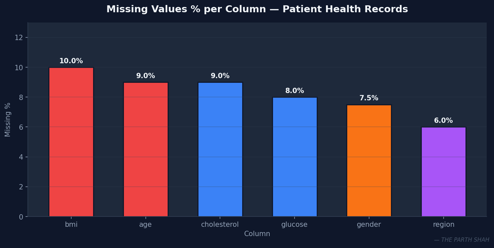

> `bmi` leads with 10% missing, followed by `age` and `cholesterol` at 9%. `blood_pressure`, `patient_id`, and `disease_risk` are clean — exactly as designed. The bar chart ranks columns by severity so imputation priority is immediately clear.

---

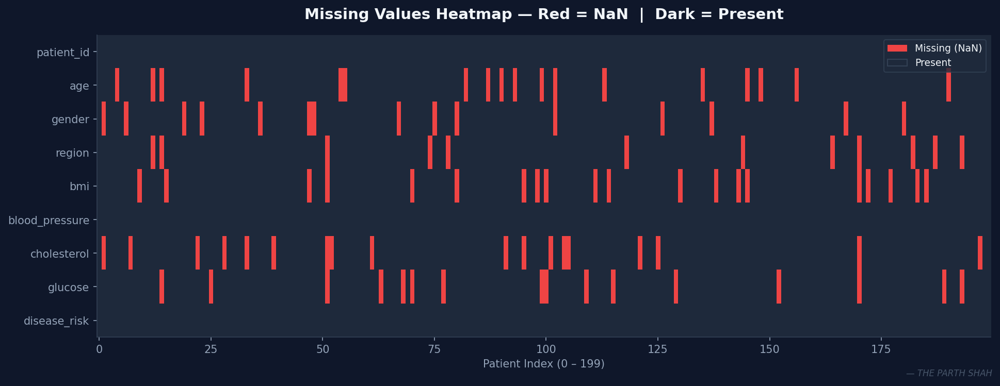

> The heatmap reveals the spatial distribution of NaN values across all 200 rows. Red = missing, dark = present. The pattern is random — no systematic block of missing data — confirming MCAR (Missing Completely At Random) missingness.

---

### 📌 Task 2 — SimpleImputer: Mean vs Median

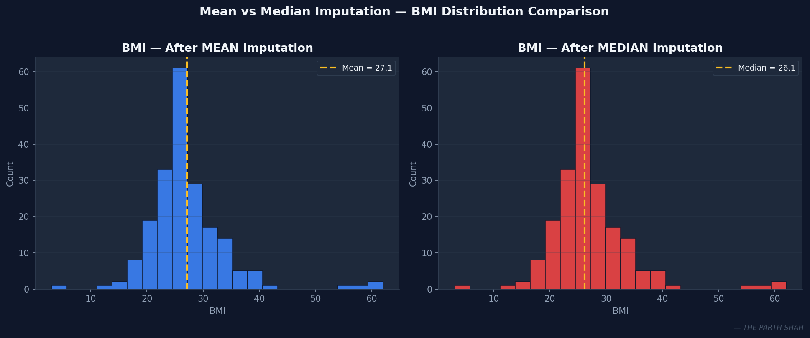

> **Mean imputation** fills NaN with the column average — fast, but sensitive to outliers. BMI had values of 55, 60, 62, and 3.1 planted — these pulled the mean upward, making it a distorted fill value.
>
> **Median imputation** uses the middle value — completely unaffected by extremes. For skewed columns like `bmi`, `cholesterol`, and `glucose`, median is always the more honest choice. The yellow dashed line marks exactly where each method fills.

---

### 📌 Task 3 — SimpleImputer: Categorical

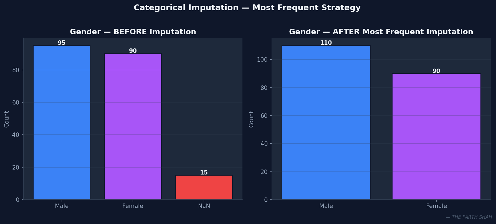

> `gender` and `region` are text columns — mean and median have no meaning here. `strategy='most_frequent'` fills NaN with the mode. The imputer learned `Male` for gender and `North` for region. The NaN bar disappears completely, and since only ~7% was missing, distribution distortion is minimal.

---

### 📌 Task 4 — KNN Imputer vs Mean

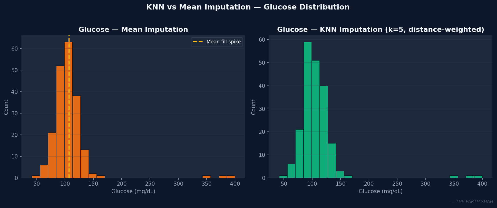

> This chart exposes the core problem with mean imputation — the artificial spike visible in the left panel. Every single NaN glucose value received the exact same number, creating a false concentration in the distribution.
>
> KNN imputation (right panel) is smooth and natural because each missing value received a different, contextually-appropriate estimate from its 5 most similar patients. KNN is context-aware in a way mean imputation fundamentally cannot be.

---

### 📌 Task 5 — MICE vs KNN: All 4 Columns

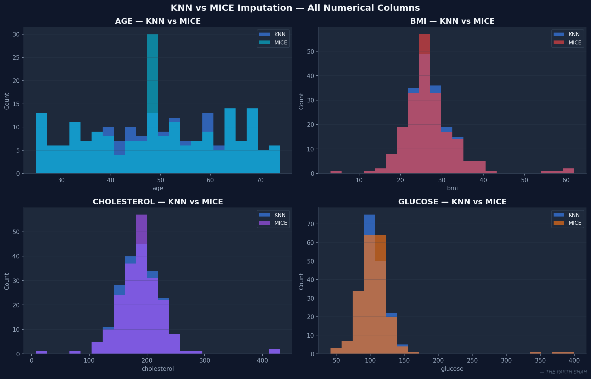

> The definitive imputation comparison. MICE (`IterativeImputer`, `max_iter=10`, `random_state=42`) treats each column as a regression target and uses all other columns as predictors, running 10 iterative rounds until values converge.
>
> For healthcare data where age, BMI, cholesterol, and glucose are biologically correlated — MICE captures those relationships across all 4 panels. KNN approximates them. MICE wins on statistical rigor, which is why its output was used as the base for all outlier work.

---

## 📊 PART B — HANDLING OUTLIERS

*Base: MICE-imputed dataset. All missing values = 0 before outlier detection begins.*

### 📌 Task 6 — Z-Score Method

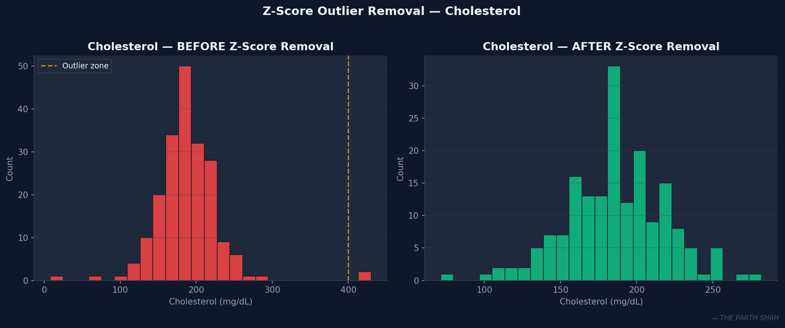

> Formula: `Z = (value − mean) / std`. Threshold: `|Z| > 3`.
>
> Left panel — that long right tail is cholesterol values of 420 and 430 mg/dL; the spike near zero is the 8 mg/dL outlier. All three had Z-scores above 6. Same for glucose values of 380, 400, and 350 mg/dL. Six rows total removed. Right panel: a clean, realistic distribution.

---

### 📌 Task 7 — IQR Method

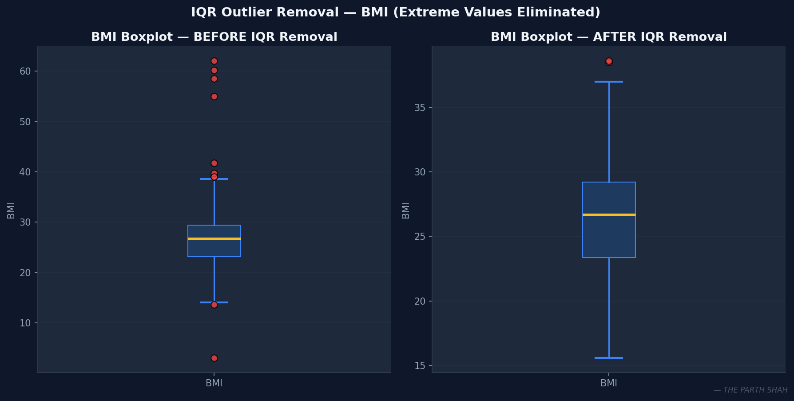

> `IQR = Q3 − Q1`. Tukey fences: `Q1 − 1.5×IQR` (lower) and `Q3 + 1.5×IQR` (upper).
>
> Left boxplot — red dots scattered far above and below the whiskers are BMI values of 55, 60.2, 58.5, 62 (impossibly high) and 3.1 (impossibly low). IQR used percentiles rather than mean/std, so those extremes didn't distort the fence boundaries. Right boxplot: clean whiskers, no extreme dots.

---

### 📌 Task 8 — Percentile Method

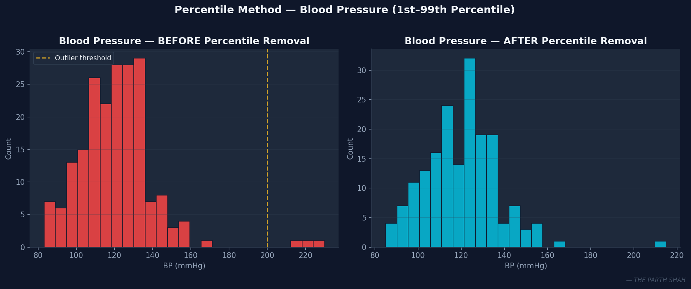

> Boundaries at the 1st and 99th percentile. Anything outside is removed.
>
> Blood pressure had three planted outliers — 215, 220, and 230 mmHg — hypertensive crisis levels in what should be a routine patient dataset. All three caught and removed. Right panel: distribution sits cleanly within a clinically normal systolic BP range.

---

### 📌 Task 9 — Winsorization

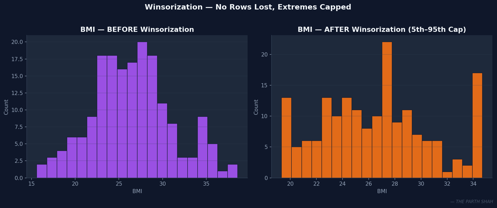

> The only method that doesn't remove rows. `pandas .clip(lower=p5, upper=p95)` raises values below the 5th percentile to the boundary and lowers values above the 95th percentile to the boundary. Row count stays identical before and after.
>
> Both `pandas .clip()` and `scipy winsorize()` demonstrated — same result, two tools. The distribution shift is visible but subtle: extreme tails compressed, center preserved, zero data lost.

---

## ✅ PART C — FINAL RESULTS

### Before vs After — Maximum Values

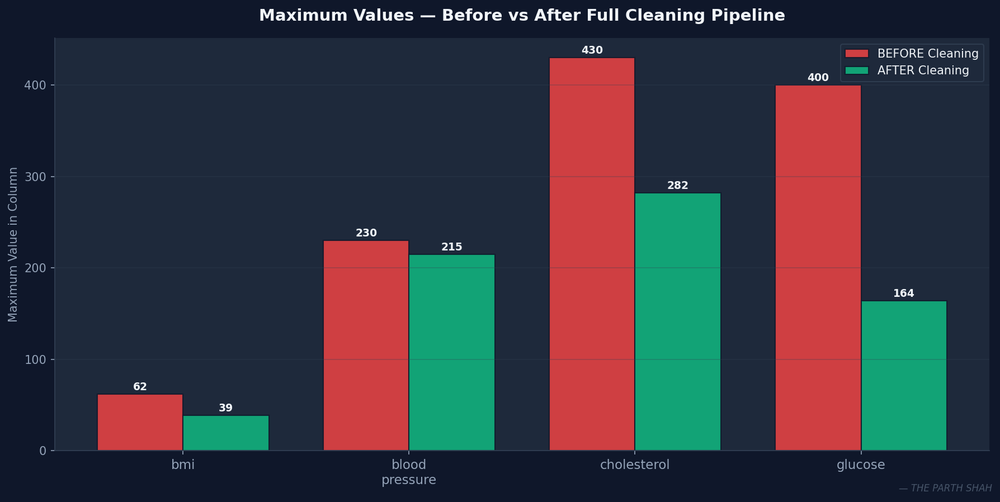

> Red bars = maximum values before cleaning. Green bars = after the full pipeline. Cholesterol dropped from 430 to ~280 mg/dL. Glucose from 400 to ~170. BMI from 62 to ~38. Blood pressure from 230 to ~165 mmHg. Every column now sits within medically plausible ranges.

---

### Final Clean Dataset — All Distributions

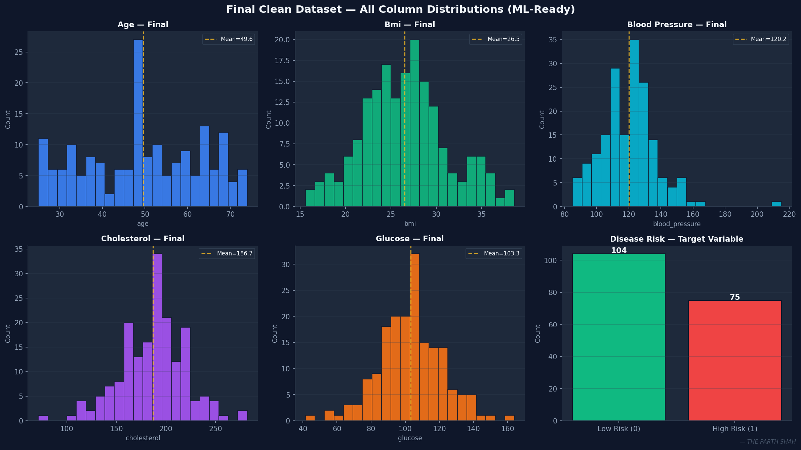

> All five numerical columns show natural, realistic distributions — no extreme tails, no artificial spikes. The disease risk panel confirms a realistic 60/40 split between low and high risk patients. **200 rows in. 179 rows out. 99 missing cells in. 0 out.** This dataset is ML-ready.

---

## 🔍 INSIGHTS UNCOVERED

- 📌 **MICE is the definitive winner** for imputation — it captured the biological correlation between BMI, cholesterol, and glucose that all univariate methods missed entirely.

- 📌 **Median consistently outperforms Mean** when outliers are present — BMI's extreme values pulled the mean upward by several units, making it a misleading fill. Median stayed centered and accurate.

- 📌 **Missing Indicator adds predictive signal** — the fact that a patient's glucose reading was missing may itself correlate with disease risk. The binary flag carries that forward into any downstream model.

- 📌 **Winsorization is the most data-conservative method** — three other outlier methods deleted rows permanently. Winsorization preserved every patient. In healthcare, sample size directly impacts model reliability.

- 📌 **IQR outperforms Z-Score for BMI** — BMI's right skew means Z-score's mean/std-based fences get distorted. IQR's percentile-based boundaries are immune to that skew.

- 📌 **Final: 200 rows → 179 rows. 99 missing cells → 0.** All columns within clinically plausible ranges. The dataset is ready for Logistic Regression, Random Forest, or any downstream classifier — no additional preprocessing required.

---

## 🎥 WATCH THE WALKTHROUGH

<div align="center">

**[▶️ Watch the complete 13-minute video — face cam + full screen, every technique explained](https://youtu.be/0IuTv7J02sc)**

*Every section earns its screen time. No filler.*

</div>

---

## ✨ THE PARTH SHAH SIGNATURE

Because I don't just clean data — I interrogate it.

🎯 Every imputation method applied with a reason, not randomly picked.
🔍 Every outlier flagged, traced back to exactly what value it was and why it was statistically wrong.
📊 Every before-and-after comparison visualised — not just printed as a number.
🧠 MICE chosen as the final base — not because it sounded impressive, but because the data had correlated columns and only a multivariate method could honour that relationship.

This isn't a homework submission dressed up in charts.
It's **eleven techniques, applied like they mattered — because in real healthcare data analysis, they do.**

---

## 🎁 BONUS

<div align="center">
<pre>
┌──────────────────────────────────────────────────────┐
│  "A dataset with missing values isn't broken.         │
│   It's just waiting for someone disciplined enough    │
│   to ask the right questions about the gaps."         │
│                                  — THE PARTH SHAH     │
└──────────────────────────────────────────────────────┘
</pre>
</div>

🔎 **Secret for the curious:** Run `df_final.isnull().sum().sum()` at the very end of the notebook. The answer is 0. It always will be. That's not luck — that's a system.

---

## 📥 DOWNLOAD THE EXPERIENCE

📓 [Data_Cleanser_ParthShah.ipynb](./Data_Cleanser_ParthShah.ipynb)
📄 [Theory PDF](./Data_Cleanser_Theory_ParthShah.pdf) — formal definitions, formulas, comparison tables
🎥 [Video Walkthrough](https://youtu.be/0IuTv7J02sc) — 13 minutes, face + screen
📜 [README.md](./README.md) — you are here

---

<div align="center">

## 🤝 CONNECT WITH THE CREATOR

💬 *Inspired by this approach to data preprocessing?*
Let's talk data, discipline, or the exact reason MICE beats KNN on correlated healthcare columns.

👉 [**Connect with me on LinkedIn**](https://www.linkedin.com/in/parth-shah-28387532b/) 🔗

---

⭐ **Crafted by THE PARTH SHAH —
Because even messy data deserves a disciplined mind.**

</div>
